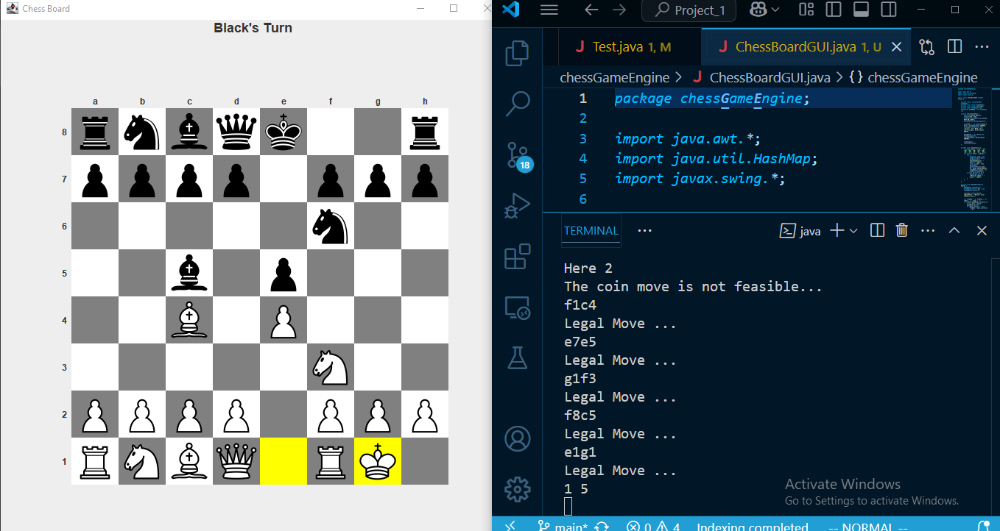

# CHESS_ENGINE

**Targets**

1.Initial Design Based on the string based move triggers [Accomplished]

-> Clone the Repository to your local Machine  
-> cd to the Directory of the Package folder  

> javac -d class src/chessGameEngine/\*.java  
> java -cp class chessGameEngine.Test  

->Or to just run the .jar file of the package[Recommended] 

> java -jar ./class/chessGameEngine.jar 

->To create a JAR file  

> jar cvfm chessGameEngine.jar manifest.txt chessGameEngine 

[The manifest.txt contains the class which contains main method] 

> just Type **from** and **to** Positions  [ fromCol[a-h] fromRow[1-8] toCol[a-h] toRow[1-8] ] 

    (eg) e2e4,a7a6....

2.UI plugin  
-> Initally Stage to just Display the board,moves and Turn. 

3.Developing Reinforcement Learning model for the Bot. 
->Stockfish Engine has been used for BestMoves ,the custom model could be implemented but the perfermance wouldn't be as much as Stockfish advanced humongous model but still an exciting work to try implement one. 
->The custom model would follow the UCI guidelines for communication with GameEngine as followed by current Engine being used
